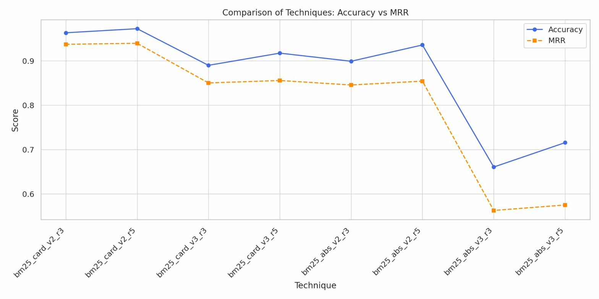

# Knowledge and Context Compression via Question Generation

**Enhancing Multihop Document Retrieval without Fine-tuning**

[](https://doi.org/10.3390/xxxxx)
[](LICENSE)
[](https://python.org)

---

## Overview

This repository contains the source code, evaluation data, and interactive demo for our paper on **question-based knowledge encoding** for RAG systems. The approach improves both single-hop and multi-hop retrieval **without fine-tuning**, achieving:

| Metric | Our Approach | Best Baseline |
|--------|-------------|---------------|
| **Accuracy (Single-hop)** | 0.844 | 0.789 (BM25) |
| **MRR (Single-hop)** | 0.803 | 0.677 (BM25) |
| **F1 (Multi-hop, Llama3)** | 0.550 | 0.412 (CFIC-7B) |
| **Storage Reduction** | ~80% | — |



## Key Contributions

1. **Question-driven knowledge compression** — scientific papers are compressed into lightweight "paper-cards" (~5 KB each) using generated questions and queries, replacing 44K+ chunk embeddings with just 218 vectors.

2. **Syntactic reranking without training** — a recursive syntactic splitting algorithm decomposes queries at POS boundaries and reranks passages by document frequency, preserving semantic flow.

3. **State-of-the-art multi-hop retrieval** — on LongBenchQA v1 (2WikiMultihopQA), the syntactic reranker with LLaMA2-Chat-7B achieves F1 = 0.52, surpassing chunking (0.328) and fine-tuned baselines (0.412).

## Repository Structure

```
├── src/                        # Source code
│   ├── services.py             # Pinecone & embedding services
│   ├── main.py                 # Main retrieval pipeline
│   ├── main2.py                # Batch query processing
│   ├── util_llama.py           # Two-stage retrieval utilities
│   ├── utils.py                # Utility functions & retrieval approach
│   ├── create_token_db.py      # Token DB creation & reranking
│   ├── token_db.py             # Keyword matching & lexical filtering
│   ├── question_generation.py  # LLM-based question & query generation
│   ├── generate_card.py        # Paper-card generation
│   ├── paper_compresser.py     # Markdown section extraction
│   ├── chunk_method.py         # Chunking baselines (recursive, fixed-size)
│   ├── pine_questions.py       # Pinecone question upserting
│   ├── upsert_pine_card.py     # Pinecone card upserting
│   ├── json_extractor.py       # Paper analysis JSON extraction
│   ├── create_tokens_data.py   # Token data preparation
│   ├── gold_question_data.py   # Gold standard test data creation
│   └── doc_chunk.py            # Embedding test script
│
├── data/                       # Evaluation datasets
│   ├── llama3resultqawiki.csv              # Full retrieval results (300 queries)
│   ├── llama3resultqawiki_r3_50_samples.csv # Top-3 results (50 samples)
│   ├── llama3resultqawiki_r3.csv           # Top-3 results (small sample)
│   ├── llama3goldtest.csv                  # Gold standard test set
│   ├── llama3goldtest_custom_id.csv        # Gold test with custom IDs
│   ├── model_results.csv                   # Multi-hop base model results
│   └── model_results_sin_one_instruct.csv  # Multi-hop + syntactic results
│
├── evaluation/                 # Evaluation scripts
│   ├── ra.py                   # Metric computation (Accuracy, MRR, F1, Precision, Recall)
│   └── evaluation.py           # (Reserved for additional evaluations)
│
├── demo/                       # Interactive browser demo
│   └── demo.jsx                # React-based demo (runs in Claude Artifacts)
│
├── figures/                    # Paper figures
│   ├── accuracy_mrr_comparison.png
│   ├── combinations.jpeg
│   └── techniques.jpeg
│
├── requirements.txt
├── .env.example
├── .gitignore
└── README.md
```

## Setup

### Prerequisites

- Python 3.10+
- [Ollama](https://ollama.ai) running locally with LLaMA3 model
- Pinecone account and API key

### Installation

```bash
git clone https://github.com/anvix9/question-knowledge-compression-rag.git
cd question-knowledge-compression-rag

pip install -r requirements.txt
```

### Environment Variables

Copy the example env file and fill in your credentials:

```bash
cp .env.example .env
```

Required variables:
- `PINECONE_API_KEY` — your Pinecone API key
- `PINECONE_INDEX_NAME` — your Pinecone index name

### Running the Pipeline

**1. Extract sections from papers:**
```bash
python src/paper_compresser.py
```

**2. Generate questions and queries:**
```bash
python src/question_generation.py
```

**3. Generate paper-cards:**
```bash
python src/generate_card.py
```

**4. Upsert to Pinecone:**
```bash
python src/pine_questions.py
```

**5. Run retrieval:**
```bash
python src/main.py
```

**6. Batch evaluation:**
```bash
python src/main2.py
```

**7. Compute metrics:**
```bash
python evaluation/ra.py
```

## Datasets

The experiments use:

- **Single-hop**: 109 scientific papers from ArXiv (NLP category)
- **Multi-hop**: [LongBench QA v1](https://github.com/THUDM/LongBench) — 2WikiMultihopQA (200 documents) and 2WikiMultihopQA_e (300 documents)

## Results Summary

### Single-Hop Retrieval (109 papers)

| Approach | Accuracy | MRR |
|----------|----------|-----|
| **Our Approach** | **0.844** | **0.803** |
| BM25 | 0.789 | 0.677 |
| Recursive Chunking | 0.256 | 0.217 |
| Fixed-size Chunking | 0.231 | 0.198 |

### Multi-Hop Retrieval (2WikiMultihopQA)

| Model | F1 |
|-------|-----|
| **Llama3 (ours)** | **0.550** |
| **Llama2-7B-chat (ours)** | **0.520** |
| CFIC-7B | 0.412 |
| GPT-3.5-Turbo-16k | 0.377 |
| Llama2-7B-chat (baseline) | 0.328 |

### Storage Efficiency

| Method | Embedding Records |
|--------|-------------------|
| Fixed-size Chunking | 44,809 |
| Recursive Chunking | 38,509 |
| **Paper-cards (ours)** | **109** |

## Interactive Demo

The `demo/demo.jsx` file contains a React-based interactive demo showcasing:

- Pipeline walkthrough (6 stages)
- Single-hop retrieval explorer with real results
- Performance metrics dashboard
- Multi-hop F1 comparison
- Syntactic reranker step-by-step visualization

The demo uses pre-computed evaluation data and requires no model loading.

## Citation

If you find this work useful, please cite:

```bibtex
@article{eponon2025knowledge,
  title={Knowledge and Context Compression via Question Generation: Enhancing Multihop Document Retrieval without Fine-tuning},
  author={Eponon, Alex Anvi and Abdullah and Shahiki-Tash, Moein and Batyrshin, Ildar and Shaukat, Kamran and Ramos, Luis and Maldonado-Sifuentes, Christian},
  journal={MDPI},
  year={2025}
}
```

## Authors

- **Alex Anvi Eponon** — Centro de Investigación en Computación, IPN, Mexico
- **Abdullah** — Centro de Investigación en Computación, IPN, Mexico
- **Moein Shahiki-Tash** — Centro de Investigación en Computación, IPN, Mexico
- **Ildar Batyrshin** — Centro de Investigación en Computación, IPN, Mexico
- **Kamran Shaukat** — Torrens University Australia
- **Luis Ramos** — Centro de Investigación en Computación, IPN, Mexico
- **Christian Maldonado-Sifuentes** — Centro de Investigación en Computación, IPN, Mexico

## License

This project is licensed under the MIT License — see the [LICENSE](LICENSE) file for details.

## Acknowledgements

This work was done with partial support from the Mexican Government through grant A1-S47854 of CONACYT, Mexico, and grants 20250738, 20260367 of the Secretaría de Investigación y Posgrado of the Instituto Politécnico Nacional, Mexico.
